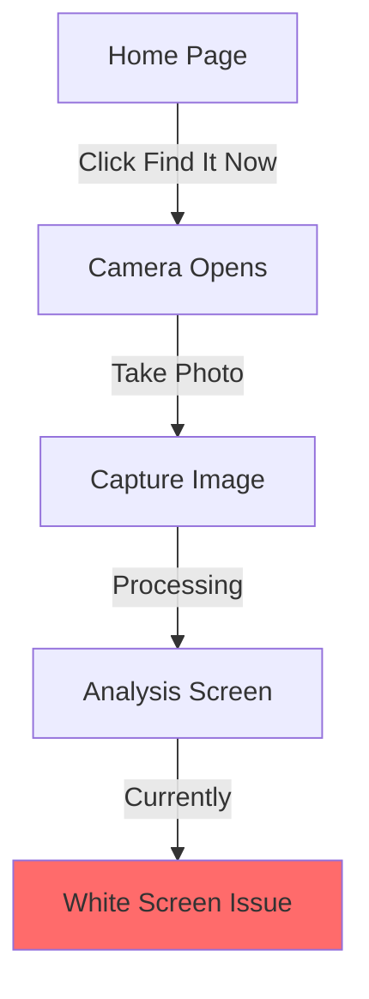

# Snapp - Current State Documentation

## Project Overview
Snapp is a clothing discovery web app initially built using bolt.new that allows users to:
- Take photos of clothing items
- Get AI-powered analysis of the image
- Find exact or similar items across stores
- Compare prices and find the best deals

## Current Implementation

### Web App
```
URL: https://animated-babka-ed8206.netlify.app
```

### Current User Flow


## MVP Requirements

### Phase 1: Critical Fixes
1. Camera Functionality
   ```
   - Debug camera opening issues
   - Ensure mobile back camera usage
   - Add proper error handling
   ```

2. Analysis Flow
   ```
   - Fix white screen after analysis
   - Implement basic results display
   - Add loading states
   ```

3. Core Backend Integration
   ```
   - Image analysis implementation
   - Basic product matching
   - Initial store comparison
   ```

### Phase 2: Essential Features
1. Mobile App Conversion
   ```
   - React Native implementation
   - Core functionality port
   - Mobile optimization
   ```

2. Basic Backend Services
   ```
   - Essential APIs
   - Basic database setup
   - Fundamental caching
   ```

## Future Enhancements (Post-MVP)
- Enhanced product matching
- Advanced filtering
- User accounts
- Favorites system
- Price alerts

## Development Setup

### Repository Access
```bash
# Repository will be shared via GitHub
# Access will be granted through proper organization invitation
```

### Deployment
```bash
# Current deployment on Netlify
# Development environment setup details will be provided separately
```

## Development Priorities
1. Fix existing functionality
2. Implement core MVP features
3. Mobile app conversion
4. Essential backend services

## Notes for Developers
- Built with bolt.new
- Mobile-first approach required
- Focus on MVP functionality
- Clean code architecture needed

---

Access credentials and sensitive information will be shared through secure channels upon project initiation.
